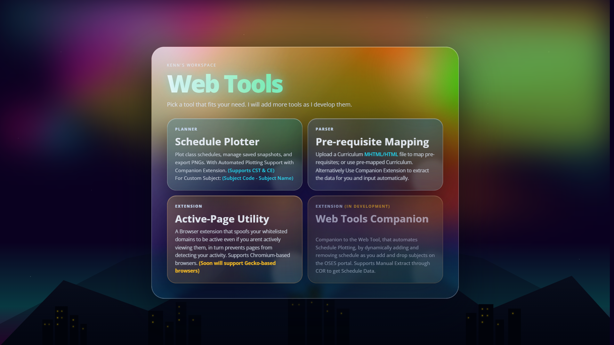
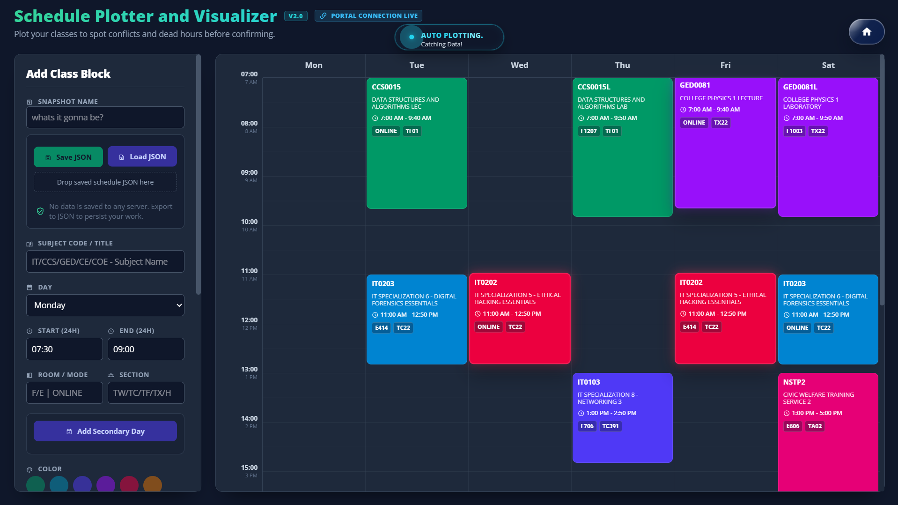
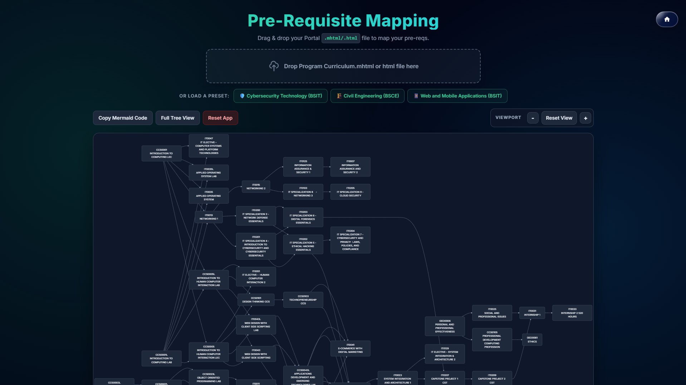
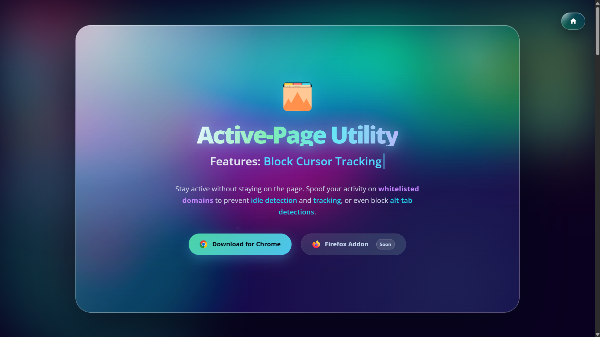
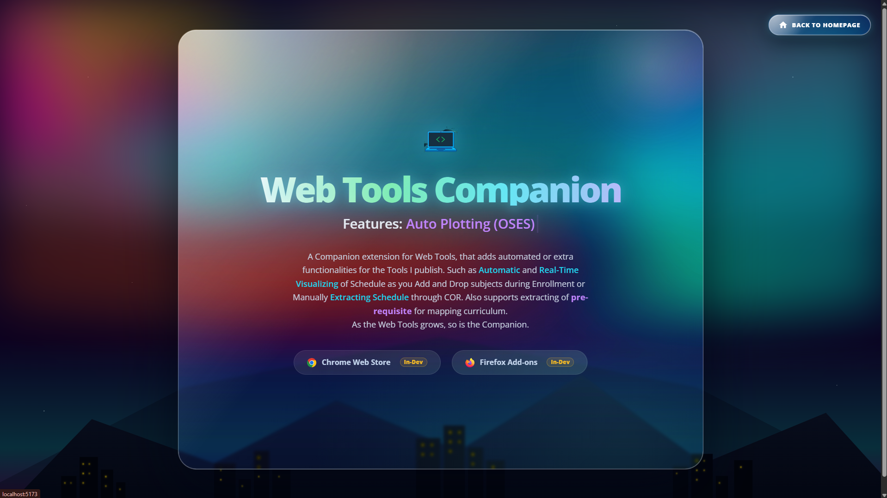

# Web Tools
This web application primarily consists of static webpages, designed to be lightweight as possible without any frameworks. Designed to be **local only**, data are not transferred to a cloud server or anywhere for that matter. If you are using the Schedule Plotter use the Save and Load JSON functionality to save your progress, if you need to use it in the future, and Export to PNG if you need it to be **stored** as an image for your phone.

I developed this web application to be accessible as possible, direct and no bloats. But this Project has a **Companion Extension** that performs certain actions such as **Auto Schedule** that automatically retrieves the data from OFES and insert to the schedule plotter. 

Any new projects I could think of will be appended here.

# Domain and Companion

**Domain**: [Main Homepage of Web Tools](tools.kendavila.me)

**Web Tool Companion:**
>  **Download through Chrome Webstore:** 🕦In Progress

# Screenshots

### **Homepage (v2.0)**

Reworked Theme of Homepage, and applied to some parts of the webapp.

***

### **Plotter (v2.0)**

***

### **Pre-Requisite Mapping**

***

### **Active-Page Utility**

***

### **Web Tools Companion**

# TODO:

- [ ] Create Global v2 of Dynamic Island to its own module, to be used by other web tools as well, using GSAP and Physics based Animations.